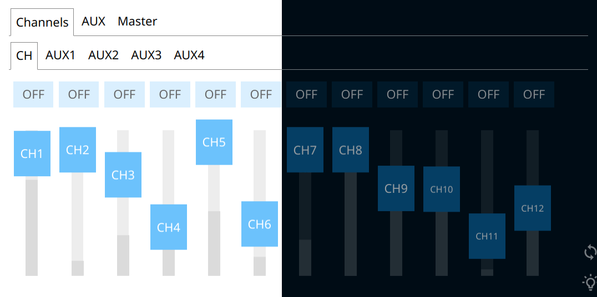

# remote-mixer

Simple web-based interface to remote-control mixing consoles.

- 🎚 Compatible with different mixers
- 📱Responsive and mobile-friendly
- 🚀 Lightweight and performant
- 🕸️ Connect multiple clients
- 🌓 Light and dark mode



> **🚧 This project is still Work in Progress! 🛠️**
>
> It should be stable enough to use at small events, but do not rely on it as your only means of mixing. **Use at your own risk**.
>
> I'm still not sure about the general direction for this project.
> Feel free to fork and experiment - PRs welcome.

## Features

This project is not meant to control every little functionality of a certain mixing console; usually, there are better alternatives around for that. However, many of them

- only work for a single mixing console model
- only run on a single platform like Windows or iOS
- only support a single connected client at the same time
- are not mobile-friendly

This project tries to bridge these limitations by supporting basic controls for different mixing consoles, accessible from any device (mouse or touch), and multiple devices at once.

### Supported Mixing Consoles

- [Yamaha 01v96](./backend/src/devices/yamaha-01v96/README.md)
- [Behringer X32 / Midas M32](./backend/src/devices/behringer-x32/README.md)
- _Add your own ([see below](#adding-support-for-other-mixing-consoles))_

### Available Controls

- Faders
- On/Off buttons
- Names
- Meters
- Categories (tabs), 2 levels deep
- Colors

## Getting Started

### Software Needed

- [Node.js](https://nodejs.org/en/)
- [Yarn](https://yarnpkg.com/lang/en/)

Build tools for native Node.js addons are also needed depending on your platform. If the installation fails, install the tools listed in the [node-gyp documentation](https://github.com/nodejs/node-gyp/blob/master/README.md#installation).

### Setup

Install and setup:

```shellscript
> yarn
```

Start in development mode with hot reloading:

```shellscript
> yarn start
```

Start in production mode:

```shellscript
> yarn start:prod
```

## Configuration

Edit the `config/remote-mixer-config.js` file. Instructions on how to configure each compatible mixing console are usually contained in the corresponding README in `backend/src/devices`.

```js
const userConfig = {
  httpPort: 8080,
  logLevel: 'info',
  device: 'dummy',
}

module.exports = userConfig
```

## Development

### Adding support for other mixing consoles

Code to control different mixing consoles is located in `backend/src/devices`. Each file (or `index.ts` in a sub-directory) needs to have a `DeviceController` as default export.

```ts
import { DeviceController, DeviceMessageListener } from '@remote-mixer/types'

export default class MyDeviceController implements DeviceController {
  deviceConfig = {
    categories: [
      {
        key: 'ch',
        label: 'Channels',
        count: 32,
        meters: true,
        namePrefix: 'CH',
        faderProperties: [
          { key: 'value', label: 'CH' },
          { key: 'aux1', label: 'AUX1' },
          // ...
        ],
      },
      {
        key: 'aux',
        label: 'AUX',
        count: 4,
        namePrefix: 'AUX',
      },
      // ...
    ],
  }

  constructor(private listener: DeviceMessageListener) {
    // connect, sync, and call this.listener() for any change
  }

  change(category: string, id: string, property: string, value: string): void {
    // send the change to the mixing console
  }
}
```

Checkout the [dummy device](./backend/src/devices/dummy.ts) for a minimal example that sends periodic random changes.

You can use existing device controllers as a baseline for similar consoles:

- [Yamaha 01v96](./backend/src/devices/yamaha-01v96/index.ts) for a MIDI controller
- [Behringer X32](./backend/src/devices/behringer-x32/index.ts) for an OSC controller
